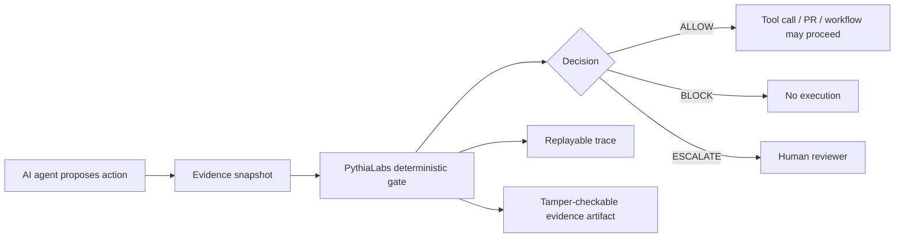

# Grant Evidence Package

Status: reviewer-facing evidence package.

Scope: this document summarizes the current open-source MVP, reproducible reviewer path, evidence artifacts, explicit non-claims, and near-term research roadmap for grant reviewers.

## One-sentence claim

PythiaLabs is an open-source prototype for deterministic pre-execution evidence gates: before an AI agent takes a high-risk action, the system evaluates available evidence and returns a replayable `ALLOW` / `BLOCK` / `ESCALATE` decision.

## Reviewer path

A reviewer should be able to inspect the project without relying on private services, external APIs, or production credentials.

```bash
mix deps.get
mix test
make demo
```

Additional deterministic showcases:

```bash
mix run examples/agent_infra_action_showcase.exs
mix run examples/banking_ai_risk_showcase.exs
mix run examples/web3_treasury_full_showcase.exs
```

Landing page build:

```bash
cd site
npm install
npm run build
npm run preview
```

## Architecture at a glance



The central boundary is before execution. PythiaLabs does not replace coding agents, CI systems, transaction simulators, wallet security, human review, or runtime security controls.

## Current evidence matrix

| Scenario | Reviewer question | Expected decision shape | Evidence path | Current status |
| --- | --- | --- | --- | --- |
| Agent Infrastructure Action Safety | Should an agent be allowed to perform a destructive infrastructure-adjacent action? | `ALLOW` / `BLOCK` with stable stop reasons | `examples/agent_infra_action_showcase.exs`, `docs/agent_infra_action_showcase_expected_output.md` | Deterministic local showcase |
| Banking AI Risk | Should a high-risk financial/agentic action proceed under approval, freshness, temporal authorization, and decision-time knowledge checks? | `ALLOW` / `BLOCK` / reviewer-facing evidence | `examples/banking_ai_risk_showcase.exs`, `docs/banking_ai_risk_showcase_expected_output.md` | Deterministic local showcase |
| Web3 Treasury Governance | Should a DAO treasury action proceed under quorum, timelock, voting-window, transfer-window, and evidence-integrity constraints? | Accepted or rejected treasury action with chronological trace | `examples/web3_treasury_full_showcase.exs`, `docs/web3_treasury_full_showcase_expected_output.md` | Deterministic local showcase |
| AI Coding Agents / CI Autofix | Should an autonomous coding agent be allowed to apply a fix, open/update a PR, change dependencies, or touch deploy-adjacent files? | `ALLOW` / `BLOCK` / `ESCALATE` before tool call | `docs/ai_coding_agents_ci_autofix_use_case.md` | Documented use case; implementation roadmap |
| Paid Review Demo | Can a reviewer run one compact demo and inspect evidence records? | Deterministic output plus evidence artifact | `make demo`, `examples/paid_review_demo_expected_output.md` | Single-command local demo |

## What is already implemented

- Deterministic local demos for high-risk agentic action review.
- Stable decision vocabulary: `ALLOW`, `BLOCK`, `ESCALATE`.
- Reviewer-facing evidence artifacts and expected output documents.
- Evidence digest / verification flows in local Web3 treasury demos.
- Root README positioning that separates PythiaLabs from Web3 transaction simulators.
- Documentation index for architecture, positioning, demos, funding, and governance.
- Landing page with demo proof, paid review positioning, validation tracks, and lightweight pilot-interest capture.
- Open-source maintainer workflow: scoped PR review, duplicate/superseded PR cleanup, contributor guidance, and docs-first onboarding.

## What this project does not claim yet

PythiaLabs currently does not claim:

- production enforcement,
- production cryptography,
- wallet integration,
- smart-contract execution,
- RPC/indexer integration,
- cloud-provider integration,
- IAM enforcement,
- regulatory compliance,
- certified cybersecurity protection,
- replacement of human review,
- replacement of CI, coding agents, transaction simulators, or wallet/security tools.

The current value is not production control. The current value is a reproducible evidence-gate prototype that makes high-risk AI-agent action decisions inspectable, replayable, and easier to evaluate.

## Why this is grant-relevant

Advanced AI agents are moving from text generation into real actions: code changes, infrastructure operations, financial workflows, governance steps, and tool calls. Prompt instructions alone are not a reliable safety boundary for consequential actions.

PythiaLabs explores a narrower and testable safety primitive:

```text
agent proposes action -> evidence snapshot -> deterministic gate -> ALLOW / BLOCK / ESCALATE -> replayable trace
```

This gives grant reviewers a concrete artifact to evaluate rather than only a conceptual proposal.

## Research / build roadmap

Near-term grant-funded work can focus on:

1. **Trace schema hardening** — standardize evidence records, stop reasons, decision codes, and replay metadata.
2. **Benchmark suite** — define scenario corpora for infrastructure, coding-agent, financial, governance, and multi-step agent workflows.
3. **Replay fidelity** — measure whether a decision can be reproduced from the same trace and evidence snapshot.
4. **Policy hooks** — add configurable gates for authorization, freshness, risk classification, and human escalation.
5. **Adapters** — connect the gate boundary to agent frameworks, CI workflows, MCP-style tools, and review surfaces.
6. **Comparative evaluation** — compare against unstructured logging, prompt-only guardrails, and after-the-fact monitoring.
7. **Open reviewer artifacts** — publish expected outputs, sanitized traces, and audit-friendly examples.

## Suggested grant reviewer checklist

A reviewer can ask:

- Can I run a demo locally without private infrastructure?
- Does the system produce stable decisions and stop reasons?
- Is there an explicit evidence path from input to decision?
- Are non-claims and current limitations stated clearly?
- Is the category boundary clear: pre-execution evidence gate, not downstream execution simulation?
- Is there a plausible path from prototype to benchmarkable research infrastructure?

## Current strongest positioning

Use this formulation in applications:

```text
PythiaLabs is an open-source prototype for deterministic pre-execution evidence gates for AI-agent actions. It evaluates whether proposed high-risk actions should be allowed, blocked, or escalated before tools are called, producing reviewer-facing evidence and replayable traces.
```
