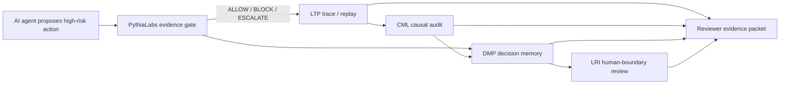

# Liminal Evidence Stack — Portfolio Reviewer Map

Status: portfolio-level reviewer map.

Scope: this document explains how PythiaLabs, LTP, CML, DMP, and LRI fit together as a tagged, reproducible open-source portfolio for trustworthy agentic systems and human-boundary governance.

## One-sentence summary

The Liminal Evidence Stack is a set of open-source artifacts for making high-risk AI-agent actions reviewable before execution, traceable during execution, auditable after execution, accountable as decisions, and bounded by human revisability constraints.

## Five-minute reviewer path

If you only have five minutes, read this document and answer:

```text
Does this portfolio separate action gating, trace replay, causal audit, decision memory, and human-boundary protection into narrow, testable artifacts?
```

Then inspect the tagged reviewer-ready snapshots:

| Layer | Repository | Current snapshot |
|---|---|---|
| PythiaLabs | `safal207/pythiaLabs` | `v0.1-reviewer-ready` |
| LTP | `safal207/L-THREAD-Liminal-Thread-Secure-Protocol-LTP-` | `v0.2-100k-evidence-upgrade` |
| CML | `safal207/Causal-Memory-Layer` | `v0.1-reviewer-ready` |
| DMP | `safal207/DMP-decision-memory-protocol` | `v0.1-reviewer-ready` |
| LRI | `safal207/Living-Relational-Identity-LRI` | `v0.3-evidence-expansion` |

## Why this stack exists

AI agents are moving from text generation into consequential actions: code changes, infrastructure operations, financial workflows, governance steps, tool calls, and long-term human interaction.

A final answer or final outcome is not enough to evaluate safety.

A reviewer needs to know:

- what action was proposed;
- whether it should have been allowed before execution;
- what path the agent followed;
- whether the path was replayable and admissible;
- whether the action had valid causal permission and responsibility lineage;
- what decision was made, why, and whether later reality changed its reversibility;
- whether human identity, revisability, consent drift, and relational boundaries were preserved.

The Liminal Evidence Stack separates those concerns into small, testable layers.

## System flow

```text
Agent proposes action
  -> PythiaLabs gates the action before tool call
  -> LTP captures/replays the execution path
  -> CML audits causal permission and responsibility lineage
  -> DMP preserves decision memory and irreversibility assumptions
  -> LRI protects human revisability and identity-boundary invariants
  -> reviewer receives structured evidence instead of narrative-only logs
```

## Architecture at a glance



## Layer responsibilities

| Layer | Main question | Artifact role | Current repository |
|---|---|---|---|
| PythiaLabs | Should this proposed high-risk agent action proceed before tools are called? | Pre-execution evidence gate / action-admissibility MVP | `safal207/pythiaLabs` |
| LTP | Was this agent execution path grounded, replayable, anchored, admissible, or rejected? | Deterministic trace replay and oversight protocol | `safal207/L-THREAD-Liminal-Thread-Secure-Protocol-LTP-` |
| CML | Why was this action allowed, and is causal permission/responsibility lineage intact? | Causal audit layer | `safal207/Causal-Memory-Layer` |
| DMP | What was decided, why, and did later reality make the decision irreversible? | Decision-memory and irreversibility-governance protocol | `safal207/DMP-decision-memory-protocol` |
| LRI | Is the human still revisable, relational, and not compressed into a fixed profile? | Human-boundary protocol with identity-boundary tests | `safal207/Living-Relational-Identity-LRI` |

## Current maturity by layer

| Layer | Current maturity | Evidence posture | Best current use |
|---|---|---|---|
| PythiaLabs | `v0.1-reviewer-ready` | deterministic demos, reviewer checklist, artifact inspection, sample reviewer report | pre-execution evidence-gate review |
| LTP | `v0.2-100k-evidence-upgrade` | 115 deterministic cases, clean-checkout validation, conformance tests | trace replay / admissibility evidence |
| CML | `v0.1-reviewer-ready` | clean-checkout validation, API smoke tests, safety eval `6/6 matched` | causal-validity audit over structured traces |
| DMP | `v0.1-reviewer-ready` | validation snapshot, schema, tests, trust files | decision memory and irreversibility review |
| LRI | `v0.3-evidence-expansion` | 54 tests, 3 identity-boundary fixtures, automated anti-profiling/classification/diagnosis checks | human-boundary governance / revisability invariants |

## What each layer deliberately does not do

The stack is designed around separation of concerns.

| Layer | Not responsible for |
|---|---|
| PythiaLabs | wallet security, transaction simulation, production enforcement, certified compliance |
| LTP | executing agents, proving universal truth, replacing observability systems |
| CML | full AI alignment, production IAM, complete prevention of unsafe actions |
| DMP | deciding what is morally/legalistically correct, replacing human governance, legal admissibility |
| LRI | profiling, identity classification, therapy, diagnosis, social scoring, automated decisioning about humans |

This is important for grant review: each artifact has a narrow, testable safety role rather than claiming to solve all AI safety problems.

## End-to-end example

A coding agent wants to modify CI configuration after a failed build.

1. **PythiaLabs** evaluates the proposed action before the agent edits files.
   - Inputs: proposed action, risk class, evidence snapshot.
   - Output: `ALLOW`, `BLOCK`, or `ESCALATE`.

2. **LTP** captures and replays the agent execution path.
   - Was the path replayable?
   - Were claims/actions anchored?
   - Did the path drift?
   - Was any output/action rejected under the oversight profile?

3. **CML** audits causal validity.
   - Was the action actually authorized by a valid parent decision?
   - Did responsibility remain intact through the chain?
   - Was there a missing parent, causal gap, or invalid handoff?

4. **DMP** preserves decision memory.
   - What was decided?
   - Why was it allowed, blocked, or escalated?
   - Was the decision believed to be reversible?
   - Did later reality make it irreversible or require supersession?

5. **LRI** protects human-boundary invariants when the action touches a person, memory, preference, identity, or relationship.
   - Is the person still revisable?
   - Is the system avoiding profiling/classification/diagnosis framing?
   - Is consent drift or silent authorship visible?
   - Is the human still the authority over their becoming?

## Evidence lifecycle

```text
proposed action
  -> evidence snapshot
  -> gate decision
  -> execution trace
  -> replay/admissibility result
  -> causal audit finding
  -> decision memory / irreversibility record
  -> human-boundary check when people are affected
  -> reviewer report
```

The stack is strongest when every stage leaves a structured artifact that can be inspected later.

## Reviewer entry points

| Repository | Reviewer entry point | Main local validation idea |
|---|---|---|
| PythiaLabs | `docs/REVIEWER_PATH.md` and `docs/RELEASE_NOTES_REVIEWER_READY.md` | `mix test`, `make demo`, optional site build |
| LTP | `docs/GRANT_EVIDENCE.md` / benchmark docs | `pnpm test`, `pnpm test:conformance`, benchmark runner |
| CML | `docs/REVIEWER_PATH.md` and `docs/RELEASE_NOTES_REVIEWER_READY.md` | `pytest`, `python scripts/run_safety_eval.py` |
| DMP | `docs/REVIEWER_PATH.md` and `docs/RELEASE_NOTES_REVIEWER_READY.md` | example validation + unittest + snapshot generation |
| LRI | `docs/REVIEWER_PATH.md`, `docs/NON_CLAIMS.md`, and release notes | `make check`, `make all`, boundary tests |

## Grant relevance

The research program is not only to build tools. It is to make safety-relevant agent behavior measurable and reproducible.

Grant-funded work can evaluate questions such as:

- Can pre-execution gates reduce unsafe or unsupported agent actions?
- Can deterministic replay expose execution-path failures that final output review misses?
- Can causal lineage checks detect actions that succeed operationally but lack valid authorization?
- Can structured decision records make governance and safety decisions auditable?
- Can human-boundary fixtures and tests prevent drift into profiling/classification/diagnosis framing?
- Can a single reviewer report combine action gate, trace replay, causal audit, decision memory, and human-boundary evidence?

## Non-claims for the full stack

The Liminal Evidence Stack currently does not claim:

- complete AI alignment;
- production-grade safety enforcement;
- certified compliance;
- replacement of human review;
- replacement of existing observability/security systems;
- universal correctness of agent decisions;
- prevention of all unsafe actions;
- production-readiness across all layers;
- identity classification, profiling, diagnosis, therapy, social scoring, or automated decisioning about humans.

The current claim is narrower and stronger:

```text
The stack provides tagged, reproducible open-source artifacts for making selected classes of agentic decisions, traces, causal lineages, decision memories, and human-boundary risks more structured, inspectable, replayable, and testable.
```

## Research roadmap

Near-term cross-stack work can focus on:

1. **Full-path demo** — one scenario that flows through PythiaLabs -> LTP -> CML -> DMP -> LRI.
2. **Shared evidence packet** — one reviewer-facing report that includes gate decision, replay result, causal audit, decision memory, and boundary status.
3. **Cross-stack fixtures** — coding agent, infra action, financial workflow, governance workflow, and long-term memory scenario.
4. **Replay fidelity metrics** — measure whether decisions and trace judgments reproduce from the same evidence.
5. **Causal-validity metrics** — evaluate missing-parent, broken-handoff, unmarked-gap, and invalid lineage failures.
6. **Human-boundary drift metrics** — evaluate identity freezing, consent drift, silent authorship, and prohibited framing drift.
7. **External review** — collect 2-3 independent reviewer comments or issues across the stack.

## Strongest positioning

Use this formulation in applications:

```text
The Liminal Evidence Stack is an open-source research stack for deterministic oversight of agentic AI systems and human-boundary governance. It combines pre-execution evidence gates, deterministic trace replay, causal-lineage audit, decision-memory records, and automated identity-boundary checks so that high-risk AI-agent behavior can be reviewed, reproduced, and evaluated from structured artifacts rather than narrative-only logs.
```

## Short version

```text
PythiaLabs gates actions.
LTP replays traces.
CML audits causal lineage.
DMP preserves decision memory.
LRI protects human revisability and identity-boundary invariants.
```

Together, they form a tagged, reproducible evidence stack for trustworthy agentic systems.
