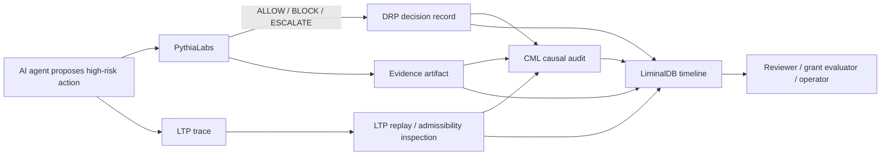

# Liminal Evidence Stack

Status: reviewer-facing architecture overview.

Scope: this document explains how PythiaLabs, DRP, LTP, CML, and LiminalDB fit together as a coherent research and infrastructure program for deterministic oversight of agentic AI systems.

## One-sentence summary

The Liminal Evidence Stack is a set of open-source artifacts for making high-risk AI-agent actions reviewable before execution, traceable during execution, auditable after execution, and reproducible from structured evidence.

## Why this stack exists

AI agents are moving from text generation into consequential actions: code changes, infrastructure operations, financial workflows, governance steps, and tool calls. A final answer or final outcome is not enough to evaluate safety.

A reviewer needs to know:

- what action was proposed,
- what decision was made,
- what evidence supported that decision,
- what path the agent followed,
- whether the path was admissible,
- whether the action was causally authorized,
- and where the evidence timeline is stored.

The Liminal Evidence Stack separates those concerns into small, testable layers.

## System flow

```text
Agent proposes action
  -> PythiaLabs gates the action before tool call
  -> DRP records the decision and rationale
  -> LTP replays and inspects the execution trace
  -> CML audits causal validity and responsibility lineage
  -> LiminalDB stores replayable timelines, state, and evidence
```

## Architecture at a glance



## Layer responsibilities

| Layer | Main question | Artifact role | Current repository |
| --- | --- | --- | --- |
| PythiaLabs | Should this proposed high-risk agent action proceed before tools are called? | Pre-execution evidence gate | `safal207/pythiaLabs` |
| DRP | What decision was made, why, what was considered, and how does it link to prior/later decisions? | Immutable decision record protocol | `safal207/DRP` |
| LTP | Was this agent execution path replayable, anchored, admissible, or rejected? | Deterministic trace replay and oversight protocol | `safal207/L-THREAD-Liminal-Thread-Secure-Protocol-LTP-` |
| CML | Was this action causally valid under authorization, intent, approval, and responsibility lineage? | Causal validity audit layer | `safal207/Causal-Memory-Layer` |
| LiminalDB | Where do adaptive state, timelines, snapshots, and replayable evidence live? | Storage / evidence substrate | `safal207/LiminalBD` |

## What each layer deliberately does not do

The stack is designed around separation of concerns.

| Layer | Not responsible for |
| --- | --- |
| PythiaLabs | Runtime orchestration, wallet security, transaction simulation, production enforcement |
| DRP | Deciding whether a decision is morally/correctly right, enforcing governance, storing all data |
| LTP | Executing agents, proving universal truth, replacing observability systems |
| CML | Running actions, full AI alignment, production IAM, complete prevention of unsafe actions |
| LiminalDB | Replacing all databases, guaranteeing production consensus/security/compliance in current form |

This is important for grant review: each artifact has a narrow, testable safety role rather than claiming to solve all AI safety problems.

## End-to-end example

A coding agent wants to modify CI configuration after a failed build.

1. **PythiaLabs** evaluates the proposed action before the agent edits files.
   - Inputs: proposed action, risk class, evidence snapshot.
   - Output: `ALLOW`, `BLOCK`, or `ESCALATE`.

2. **DRP** records the decision.
   - What was decided?
   - Why was it allowed, blocked, or escalated?
   - What evidence was considered?
   - Which prior decisions does it depend on?

3. **LTP** inspects the agent execution path.
   - Was the path replayable?
   - Were claims/actions anchored?
   - Did the path drift?
   - Was any output/action rejected under the oversight profile?

4. **CML** audits causal validity.
   - Was the action actually authorized by a valid parent decision?
   - Did responsibility remain intact through the chain?
   - Was there a missing parent, causal gap, or invalid handoff?

5. **LiminalDB** stores replayable evidence.
   - Decision records.
   - Evidence snapshots.
   - Trace events.
   - Audit findings.
   - Timeline entries and derived projections.

## Evidence lifecycle

```text
proposed action
  -> evidence snapshot
  -> gate decision
  -> decision record
  -> execution trace
  -> replay/admissibility result
  -> causal audit finding
  -> timeline storage
  -> reviewer report
```

The stack is strongest when every stage leaves a structured artifact that can be inspected later.

## Grant relevance

The research program is not only to build tools. It is to make safety-relevant agent behavior measurable and reproducible.

Grant-funded work can evaluate questions such as:

- Can pre-execution gates reduce unsafe or unsupported agent actions?
- Can deterministic replay expose execution-path failures that final output review misses?
- Can causal lineage checks detect actions that succeed operationally but lack valid authorization?
- Can structured decision records make governance and safety decisions auditable?
- Can replayable storage make evidence timelines reconstructable without mutating ground truth?

## Reviewer path across repositories

Each repository now has its own grant evidence package or reviewer-facing entry point:

| Repository | Reviewer entry point |
| --- | --- |
| PythiaLabs | `docs/GRANT_EVIDENCE.md` |
| DRP | `docs/GRANT_EVIDENCE.md` |
| LTP | `docs/GRANT_EVIDENCE.md` |
| CML | `docs/GRANT_EVIDENCE.md` |
| LiminalDB | `docs/GRANT_EVIDENCE.md` |

This document is the cross-stack overview.

## Current maturity

| Layer | Current maturity | Best current use |
| --- | --- | --- |
| PythiaLabs | Prototype / demos / reviewer evidence | Pre-execution action gating research |
| DRP | Draft protocol + reference validator | Decision provenance and auditability experiments |
| LTP | Trace replay / inspector / conformance surface | Deterministic oversight of agent traces |
| CML | Audit engine + benchmark fixtures | Causal-validity checking over structured traces |
| LiminalDB | Active Rust runtime/storage substrate | Replayable timelines and adaptive state experiments |

## Non-claims for the full stack

The Liminal Evidence Stack currently does not claim:

- complete AI alignment,
- production-grade safety enforcement,
- certified compliance,
- replacement of human review,
- replacement of existing observability/security systems,
- universal correctness of agent decisions,
- prevention of all unsafe actions,
- production-readiness across all layers.

The current claim is narrower and stronger:

```text
The stack provides implemented open-source artifacts for making selected classes of agentic decisions, traces, and causal lineages more structured, inspectable, replayable, and benchmarkable.
```

## Research roadmap

Near-term cross-stack work can focus on:

1. **Shared trace/evidence schema** — align decision records, gate outputs, traces, audit findings, and timeline storage.
2. **End-to-end benchmark scenarios** — coding agent, infra action, financial workflow, governance workflow, and web-browsing agent.
3. **Replay fidelity metrics** — measure whether decisions and trace judgments reproduce from the same evidence.
4. **Causal-validity metrics** — evaluate missing-parent, broken-handoff, unmarked-gap, and invalid lineage failures.
5. **Reviewer reports** — generate one report that includes gate decision, DRP record, LTP replay result, CML finding, and LiminalDB timeline entry.
6. **Adapters** — connect to agent frameworks, CI systems, MCP-style tools, and workflow engines.
7. **Public artifacts** — publish sanitized fixtures, expected outputs, and reproducible benchmark reports.

## Strongest positioning

Use this formulation in applications:

```text
The Liminal Evidence Stack is an open-source research stack for deterministic oversight of agentic AI systems. It combines pre-execution evidence gates, immutable decision records, deterministic trace replay, causal-lineage audit, and replayable evidence storage so that high-risk AI-agent actions can be reviewed, reproduced, and evaluated from structured artifacts rather than narrative-only logs.
```

## Short version

```text
PythiaLabs gates actions.
DRP records decisions.
LTP replays traces.
CML audits causal lineage.
LiminalDB stores timelines and evidence.
```

Together, they form a deterministic oversight stack for agentic AI.
