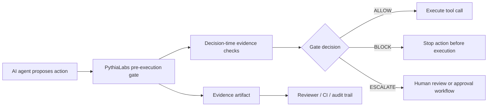

# Action Gate Architecture Diagram

This page gives a compact visual model of the PythiaLabs action-gate flow.

PythiaLabs is called before an AI agent reaches a high-risk tool call. It evaluates the proposed action against current evidence, authorization, environment, credential, and recovery context, then emits a deterministic decision and a reviewer-facing evidence artifact.

## Basic flow



## How to read the diagram

1. The agent proposes an action, but the action has not executed yet.
2. The pre-execution gate evaluates the action and its evidence context.
3. The gate returns one of three outcomes:
   - `ALLOW` — the action may proceed under the current evidence snapshot.
   - `BLOCK` — the action is stopped before reaching the execution layer.
   - `ESCALATE` — the action requires human review or a separate approval workflow.
4. The gate emits an evidence artifact so a reviewer can inspect what information was used at decision time.

## Where PythiaLabs sits

```text
AI agent
  -> proposed action
  -> PythiaLabs evidence gate
  -> ALLOW / BLOCK / ESCALATE
  -> tool call, CI system, deployment system, wallet, or other execution layer
```

The important boundary is timing: PythiaLabs evaluates the action before execution, while the action can still be stopped.

## Reviewer notes

The diagram is intentionally simple. It does not claim production enforcement, regulatory compliance, certified security, wallet protection, or smart-contract auditing. Current PythiaLabs demos are deterministic local artifacts intended for review, research, and pilot evaluation.
